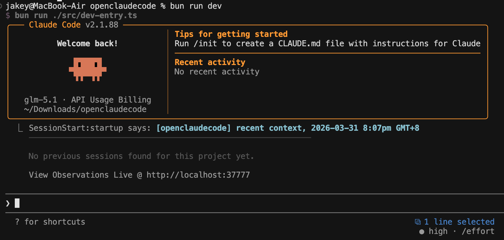

[English](README.md) | [中文](README_CN.md)

# CLaudeClone (OPENSOURCE) — Multi-Provider AI Coding Assistant

> A comprehensive architectural analysis of the open-source CLaudeClone AI coding assistant



This repository is a restored CLaudeClone source tree, a fork of Anthropic's official CLI coding assistant, reconstructed primarily from source maps and missing-module backfilling. It is not the original upstream repository state. Some files were unrecoverable from source maps and have been replaced with compatibility shims or degraded implementations so the project can install and run again.

## Quick Start

### Prerequisites

- Bun 1.3.5 or newer (install: https://bun.sh)
- Node.js 24 or newer (for native module compatibility)
- Git (for repository operations)

### Installation

After cloning the repository:

```bash
bun install
```

### Running CLaudeClone

**Option 1: Direct CLI command (recommended)**

Once installed, you can run CLaudeClone directly using the `claude` binary:

```bash
# First-party Anthropic API (default)
export ANTHROPIC_API_KEY=your-api-key
claude

# AWS Bedrock
export CLAUDE_CODE_USE_BEDROCK=true
export AWS_REGION=us-east-1
# AWS credentials configured via aws-sdk defaults (AWS_ACCESS_KEY_ID, AWS_SECRET_ACCESS_KEY)
claude

# Google Vertex AI
export CLAUDE_CODE_USE_VERTEX=true
export ANTHROPIC_VERTEX_PROJECT_ID=your-project-id
# GCP credentials configured via google-auth-library (GOOGLE_APPLICATION_CREDENTIALS or gcloud)
claude

# Azure Foundry
export CLAUDE_CODE_USE_FOUNDRY=true
export ANTHROPIC_FOUNDRY_RESOURCE=your-resource-name
# Authentication: ANTHROPIC_FOUNDRY_API_KEY or Azure AD (DefaultAzureCredential)
claude

# Custom Provider (OpenAI compatible: DeepSeek, NVIDIA, Ollama, etc.)
export CLAUDE_CODE_USE_CUSTOM=true
export CUSTOM_API_KEY=your-api-key
export CUSTOM_BASE_URL=https://api.your-provider.com/v1
claude
```

**Option 2: Development mode**

```bash
bun run dev
```

> **Note:** The `claude` binary becomes available after `bun install`. You can also invoke it via `bun run claude` if the binary isn't in your PATH.

### Version Information

Print the current version:

```bash
claude --version
# or
bun run version
```

## Overview

Claude Code is Anthropic's command-line AI coding assistant. Users interact with Claude through a terminal via natural language, combining slash commands and tool invocations to accomplish software engineering tasks. It supports multiple execution modes:

| Mode                  | Description                                                              |
| --------------------- | ------------------------------------------------------------------------ |
| **Interactive REPL**  | Real-time terminal conversation — the primary use case                   |
| **MCP Server**        | Exposes tools to external programs via Model Context Protocol            |
| **Headless/SDK**      | Unattended mode for automation pipelines and Agent SDK integration       |
| **Bridge/Remote**     | Remote control mode, orchestrated from claude.ai web UI                  |
| **Assistant Daemon**  | Background daemon process                                                |

## Multi-Provider Architecture

CLaudeClone supports multiple LLM providers through a unified abstraction layer. The `APIProvider` type defines six provider options:

| Provider   | Environment Variable           | Description                                                              |
| ---------- | ------------------------------ | ------------------------------------------------------------------------ |
| `firstParty` | *(default)*                 | Anthropic's first-party API (api.anthropic.com)                         |
| `bedrock`   | `CLAUDE_CODE_USE_BEDROCK`    | AWS Bedrock (requires AWS credentials)                                  |
| `vertex`    | `CLAUDE_CODE_USE_VERTEX`     | Google Cloud Vertex AI (requires GCP project ID)                        |
| `foundry`   | `CLAUDE_CODE_USE_FOUNDRY`    | Azure AI Foundry (requires Azure resource/API key)                      |
| `custom`    | `CLAUDE_CODE_USE_CUSTOM`     | Custom API (requires custom base URL/API key)                           |

**Provider detection** is automatic based on environment variables. The system selects exactly one provider at runtime, with `firstParty` as the default when no provider-specific variable is set.

**Benefits of multi-provider support:**

- **Flexibility**: Choose the provider that best fits your workflow, budget, or compliance requirements
- **Regional availability**: Access Claude models in different cloud regions (AWS, GCP, Azure)
- **Cost optimization**: Compare pricing across providers and select the most economical option
- **Enterprise integration**: Use existing cloud provider credentials and IAM setups
- **Model consistency**: The same Claude models (with provider-specific identifiers) are available across all platforms

The abstraction layer handles:
- Provider-specific SDK initialization (`@anthropic-ai/sdk` for first-party, `@anthropic-ai/bedrock-sdk`, `@anthropic-ai/vertex-sdk`, `@anthropic-ai/foundry-sdk`; generic endpoints for custom providers)
- Automatic translation of model identifiers (e.g., `claude-opus-4-6` → `us.anthropic.claude-opus-4-6-v1` for Bedrock)
- Region and credential management
- Uniform error handling and retry logic

---

## Provider Configuration

Detailed environment variable reference for each provider:

### Common Configuration

| Variable | Description |
| -------- | ----------- |
| `ANTHROPIC_MODEL` | Default model to use (overrides built-in defaults) |
| `ANTHROPIC_API_KEY` | First-party API key (when not using OAuth) |
| `ANTHROPIC_BASE_URL` | Custom API base URL (for first-party or compatible endpoints) |
| `ANTHROPIC_CUSTOM_HEADERS` | Additional headers to send with API requests (one per line, "Name: Value" format) |

### AWS Bedrock

| Variable | Description |
| -------- | ----------- |
| `CLAUDE_CODE_USE_BEDROCK` | Set to `true` to enable Bedrock provider |
| `AWS_REGION` or `AWS_DEFAULT_REGION` | AWS region for all models (default: `us-east-1`) |
| `ANTHROPIC_SMALL_FAST_MODEL_AWS_REGION` | Optional region override specifically for the small fast model (Haiku) |
| `AWS_ACCESS_KEY_ID`, `AWS_SECRET_ACCESS_KEY`, `AWS_SESSION_TOKEN` | Standard AWS credentials (alternatively use profile-based auth) |
| `AWS_BEARER_TOKEN_BEDROCK` | Optional bearer token for Bedrock API key authentication |
| `CLAUDE_CODE_SKIP_BEDROCK_AUTH` | Skip AWS credential loading (for testing/proxy scenarios) |

**Authentication:** Uses standard AWS SDK credential chain. Supports environment variables, `~/.aws/credentials` profiles, EC2/ECS IAM roles, and `DefaultAzureCredential` for Azure-hosted workloads.

### Google Cloud Vertex AI

| Variable | Description |
| -------- | ----------- |
| `CLAUDE_CODE_USE_VERTEX` | Set to `true` to enable Vertex provider |
| `ANTHROPIC_VERTEX_PROJECT_ID` | **Required.** Your GCP project ID |
| `VERTEX_REGION_CLAUDE_3_5_HAIKU` | Region for Claude 3.5 Haiku (e.g., `us-central1`) |
| `VERTEX_REGION_CLAUDE_HAIKU_4_5` | Region for Claude Haiku 4.5 |
| `VERTEX_REGION_CLAUDE_3_5_SONNET` | Region for Claude 3.5 Sonnet |
| `VERTEX_REGION_CLAUDE_3_7_SONNET` | Region for Claude 3.7 Sonnet |
| `CLOUD_ML_REGION` | Default region for any model without a specific override |
| `CLAUDE_CODE_SKIP_VERTEX_AUTH` | Skip GCP credential loading (for testing/proxy scenarios) |

**Region fallback order:** 1) Model-specific env var, 2) `CLOUD_ML_REGION`, 3) SDK default, 4) `us-east5`. Credentials use `google-auth-library` ADC (Application Default Credentials).

### Azure AI Foundry

| Variable | Description |
| -------- | ----------- |
| `CLAUDE_CODE_USE_FOUNDRY` | Set to `true` to enable Foundry provider |
| `ANTHROPIC_FOUNDRY_RESOURCE` | Azure resource name (constructs endpoint: `https://{resource}.services.ai.azure.com/anthropic/v1`) |
| `ANTHROPIC_FOUNDRY_BASE_URL` | Alternative: provide full base URL directly |
| `ANTHROPIC_FOUNDRY_API_KEY` | API key for authentication (if not using Azure AD) |
| `CLAUDE_CODE_SKIP_FOUNDRY_AUTH` | Skip Azure AD authentication (for testing/proxy scenarios) |

**Authentication:** If `ANTHROPIC_FOUNDRY_API_KEY` is set, uses API key auth. Otherwise uses `@azure/identity` `DefaultAzureCredential` (supports env vars, managed identity, Azure CLI, Visual Studio Code, etc.).

### Custom Provider (Generic)

| Variable | Description |
| -------- | ----------- |
| `CLAUDE_CODE_USE_CUSTOM` | Set to `true` to enable custom provider (e.g. DeepSeek, NVIDIA, Ollama) |
| `CUSTOM_API_KEY` | **Required.** Custom API key |
| `CUSTOM_BASE_URL` | API endpoint (e.g. `https://api.deepseek.com/v1` or `http://localhost:11434/v1`) |
| `CUSTOM_MODEL` | Override model ID for custom deployment |

---

## Model Abstraction System

The model abstraction layer (`src/utils/model/`) provides a unified interface for working with models across all providers. It handles model resolution, display names, aliases, and provider-specific ID translation.

### Core Modules

| Module | Purpose |
| ------ | ------- |
| `providers.ts` | Provider detection utilities (`getAPIProvider()`, `isFirstPartyAnthropicBaseUrl()`) |
| `configs.ts` | Provider-specific model ID mappings for all supported Claude models |
| `model.ts` | Model resolution, aliases (`opus`, `sonnet`, `haiku`, `best`, `opusplan`), display rendering, 1M context handling |
| `modelStrings.ts` | Canonical model name constants (e.g., `opus46`, `sonnet46`, `haiku45`) |
| `modelAllowlist.ts` | Controls which models are available to users |
| `validateModel.ts` | Validates model names and configurations |

### Model Selection Priority

1. **Session override** (`/model` command) — highest priority
2. **Startup flag** (`--model` CLI argument)
3. **Environment variable** (`ANTHROPIC_MODEL`)
4. **Saved settings** (user configuration file)
5. **Built-in default** (based on subscription tier and provider)

### Model Aliases

| Alias | Resolves To | Description |
| ----- | ----------- | ----------- |
| `opus` | Latest Opus model | Most capable for complex tasks |
| `sonnet` | Latest Sonnet model | Balanced performance (default for most users) |
| `haiku` | Latest Haiku model | Fast, economical for simple tasks |
| `best` | Latest Opus model | Synonym for `opus` |
| `opusplan` | Sonnet normally, Opus in plan mode | Smart default for plan/execution workflow |

All aliases support the `[1m]` suffix (e.g., `haiku[1m]`, `sonnet[1m]`) to enable 1M context window on models that support it.

### Model ID Mapping

The `configs.ts` module defines `ModelConfig` objects that map canonical model keys to provider-specific IDs:

```typescript
export const CLAUDE_OPUS_4_6_CONFIG = {
  firstParty: 'claude-opus-4-6',
  bedrock: 'us.anthropic.claude-opus-4-6-v1',
  vertex: 'claude-opus-4-6',
  foundry: 'claude-opus-4-6',
  custom: 'claude-opus-4-6',
} as const satisfies ModelConfig
```

At runtime, `getMainLoopModel()` resolves the user's model selection (which may be an alias or canonical name) to the exact model ID required by the active provider. This means users can select "Sonnet" and the system automatically uses the correct identifier for their chosen provider (Bedrock ARN, Vertex model name, etc.).

---

## Directory Structure

```text
src/
├── main.tsx               # CLI entry + command registration (~800KB, core hub)
├── QueryEngine.ts         # Query engine — manages conversation lifecycle
├── Tool.ts                # Tool abstract base class
├── Task.ts                # Background task abstraction
├── commands.ts            # Slash command registry
├── tools.ts               # Tool registry
├── query.ts               # Main interaction loop
├── context.ts             # Context management
├── setup.ts               # Session initialization
├── cost-tracker.ts        # Token cost tracking
├── history.ts             # Conversation history management
├── interactiveHelpers.tsx # Interactive helper components
│
├── entrypoints/           # Application entry points
├── screens/               # Top-level screens (REPL, Doctor, Resume)
├── components/            # React/Ink UI components (~146 files)
├── commands/              # Slash command implementations (~60+)
├── tools/                 # Tool implementations (~43)
├── services/              # Backend service integrations (~38)
├── hooks/                 # React Hooks (~87)
├── utils/
│   ├── model/             # Multi-provider model abstraction (~10 files)
│   │   ├── configs.ts     # Provider-specific model ID mappings
│   │   ├── model.ts       # Model resolution & display
│   │   ├── providers.ts   # Provider detection
│   │   ├── modelStrings.ts
│   │   ├── modelAllowlist.ts
│   │   ├── modelCapabilities.ts
│   │   ├── modelOptions.ts
│   │   ├── validateModel.ts
│   │   └── ...
│   └── ...                # Other utility functions (~331 total)
├── ink/                   # Custom terminal rendering engine
├── bridge/                # Remote control / Bridge mode
├── vim/                   # Vim emulator
├── state/                 # State management
├── tasks/                 # Background task implementations
├── query/                 # Query engine support modules
├── context/               # React Context providers
├── keybindings/           # Configurable keyboard shortcuts
├── skills/                # Skill system
├── plugins/               # Plugin system
├── migrations/            # Version migrations
├── constants/             # Constant definitions
├── types/                 # Type definitions
├── cli/                   # Non-interactive CLI mode
├── buddy/                 # Companion sprite animations
├── native-ts/             # Native module bindings
└── voice/                 # Voice input integration
```

---

## Core Architecture

### 1. Startup Flow

```text
main.tsx
  ├── Pre-init (MDM reads, Keychain prefetch, startup profiling)
  ├── Commander.js parses CLI arguments
  ├── Fast-path routing (--version, --dump-system-prompt, --mcp, bridge)
  └── Full REPL initialization
        ├── entrypoints/init.ts  → Config / env / telemetry / OAuth
        ├── setup.ts             → Git detection / permissions / session / worktree
        ├── replLauncher.tsx     → Ink render root
        └── screens/REPL.tsx     → Main REPL interaction loop
```

### 2. Tool System

Every capability exposed to the AI is abstracted as a Tool, defined in `Tool.ts`:

```typescript
interface Tool<Input, Output, Progress> {
  call(input: Input, context: ToolUseContext): Promise<ToolResult<Output>>
  description(): string
  inputSchema: ZodSchema           // Zod v4 validation
  isReadOnly(): boolean            // Read-only operation
  isDestructive(): boolean         // Destructive operation
  isConcurrencySafe(): boolean     // Safe for concurrent execution
  isEnabled(context): boolean      // Feature flag gate
  interruptBehavior(): InterruptBehavior
}
```

**Core Tool Inventory** (`tools/` directory):

| Category          | Tools                                                                    |
| ----------------- | ------------------------------------------------------------------------ |
| **File Ops**      | FileEdit, FileRead, FileWrite, Glob, Grep                                |
| **Execution**     | Bash (shell commands), NotebookEdit (Jupyter)                            |
| **Search**        | WebSearch, WebFetch, ToolSearch                                          |
| **Multi-Agent**   | Agent (sub-agent), TeamCreate, TeamDelete, SendMessage                   |
| **Task Mgmt**     | TaskCreate, TaskGet, TaskUpdate, TaskList, TaskStop, TaskOutput          |
| **Planning**      | EnterPlanMode, ExitPlanMode                                              |
| **Isolation**     | EnterWorktree, ExitWorktree                                              |
| **Scheduling**    | ScheduleCron (cron jobs)                                                 |
| **Integration**   | MCP (dynamic MCP tool proxy), Skill, LSP, Config                         |
| **Other**         | TodoWrite, Clipboard, Diff, Sleep                                        |

### 3. QueryEngine — The Conversation Engine

`QueryEngine.ts` is the heart of the application, managing the full conversation loop:

```text
User Input → Build Messages → Call Anthropic API (streaming) → Parse Response
    ↑                                                                     ↓
    ← ← ← ← ← ← ← Tool Results ← ← ← ← ← ← ← ← ← ← ← Tool Use detected?
                                          ↓ No                      ↓ Yes
                                      Output to user          Route to Tool
                                                                   ↓
                                                           Execute & collect result
```

Key responsibilities:

- Message construction and API invocation
- Streaming response processing
- Tool Use detection and routing
- Context window management (auto-compaction)
- Message queuing and command lifecycle

### 4. State Management

Uses a lightweight Observable Store pattern:

```text
state/
├── store.ts           # createStore<T>() → getState / setState / subscribe
├── AppStateStore.ts   # AppState type definition (deeply immutable)
├── AppState.tsx       # React Provider + useAppState() selector hook
├── selectors.ts       # Derived state selectors
└── onChangeAppState.ts # State-change side effects
```

AppState encompasses: settings, model selection, verbose mode, speculation state, task list, messages, tool permissions, todos, MCP connections, and more.

### 5. Context Compaction (`services/compact/`)

Automatically compresses conversations when they exceed the context window, with multiple strategies:

- **Auto-compact** — Triggered automatically
- **Micro-compact** — Lightweight compression
- **API micro-compact** — Server-side compression
- **Reactive compact** — Reactive compression
- **Session memory compact** — Memory-based compression

### 6. Multi-Agent Architecture

Claude Code supports Swarm mode for parallel multi-agent collaboration:

```text
Team Lead (Primary Agent)
    ├── Teammate A (InProcessTeammateTask) → Isolated Git Worktree
    ├── Teammate B (InProcessTeammateTask) → Isolated Git Worktree
    └── Teammate C (LocalAgentTask)        → Sub-agent

Coordination mechanisms:
- Shared TaskList (task assignment & status sync)
- Mailbox messaging system (inter-agent communication)
- SendMessage tool (cross-agent interaction)
```

### 7. Multi-Provider Client System

The API client factory (`src/services/api/client.ts`) dynamically creates the appropriate Anthropic SDK based on the active provider:

```typescript
export async function getAnthropicClient(params): Promise<Anthropic> {
  if (isEnvTruthy(process.env.CLAUDE_CODE_USE_BEDROCK)) {
    const { AnthropicBedrock } = await import('@anthropic-ai/bedrock-sdk')
    return new AnthropicBedrock(bedrockArgs)
  }
  if (isEnvTruthy(process.env.CLAUDE_CODE_USE_VERTEX)) {
    const [{ AnthropicVertex }, { GoogleAuth }] = await Promise.all([
      import('@anthropic-ai/vertex-sdk'),
      import('google-auth-library')
    ])
    return new AnthropicVertex(vertexArgs)
  }
  if (isEnvTruthy(process.env.CLAUDE_CODE_USE_FOUNDRY)) {
    const { AnthropicFoundry } = await import('@anthropic-ai/foundry-sdk')
    return new AnthropicFoundry(foundryArgs)
  }
  // ... nvidia, deepseek, firstParty
}
```

**Provider-specific authentication** is handled transparently:
- **Bedrock**: AWS SDK credential chain (env vars, profiles, IAM roles)
- **Vertex**: Google Application Default Credentials with project resolution
- **Foundry**: API key or Azure AD `DefaultAzureCredential`
- **Custom**: Direct API key to custom base URL
- **First-party**: OAuth tokens or direct API key

**Model ID translation** ensures each provider receives the correctly formatted identifier. The model abstraction layer (`src/utils/model/`) resolves user-friendly names to provider-specific ARNs, model IDs, or deployment names automatically.

---

## Technology Stack

### Runtime & Build

| Technology         | Purpose                                                              |
| ------------------ | -------------------------------------------------------------------- |
| **Bun**            | Runtime, `bun:bundle` feature flags + dead-code elimination          |
| **TypeScript**     | Strict mode, Zod v4 runtime validation                               |
| **React Compiler** | Optimized re-renders (`react/compiler-runtime`)                      |
| **Commander.js**   | CLI argument parsing (`@commander-js/extra-typings`)                 |
| **Biome**          | Linting and formatting                                               |
| **Build Macros**   | `MACRO.VERSION` injection, `feature()` feature gating                |
| **Provider Abstraction** | Unified configuration layer for 6+ LLM providers with automatic model ID translation |

### UI Rendering

Built on a heavily customized **Ink** (React-for-terminal) engine (`ink/` directory):

- Custom React Reconciler → terminal output
- Flexbox-style layout engine
- Full terminal I/O layer (ANSI parsing, keyboard/mouse events, focus detection)
- Design system: ThemedBox/Text, Dialog, FuzzyPicker, ProgressBar, Tabs
- Virtual scrolling message list

### AI / LLM Integration

- **Anthropic SDK** (`@anthropic-ai/sdk`) with streaming
- Extended Thinking support
- Multi-model: Sonnet / Opus / Haiku families
- **Multi-provider support**: firstParty, AWS Bedrock, Google Vertex AI, Azure Foundry, Custom (Generic)
- Provider-specific SDKs: `@anthropic-ai/bedrock-sdk`, `@anthropic-ai/vertex-sdk`, `@anthropic-ai/foundry-sdk`
- Token budget management and cost tracking

### MCP (Model Context Protocol)

- Full MCP Client (connects to external MCP servers for additional tools/resources)
- Full MCP Server (exposes Claude Code tools to external programs)
- OAuth authentication, permission management, Elicitation handling

### Observability

- **OpenTelemetry** — Distributed tracing, metrics, logs
- **GrowthBook** — Feature flags
- **Datadog** — Monitoring integration
- Startup profiler (`utils/startupProfiler.ts`)
- FPS tracking (`context/fpsMetrics.tsx`)

### Authentication & Security

- OAuth 2.0 (claude.ai authentication)
- API Key support (direct / Bedrock / Vertex)
- mTLS certificate configuration
- Permission system (default / auto / bypass modes)
- Sandbox isolation
- macOS Keychain secure storage

---

## Vim Emulator (`vim/`)

A complete Vim state machine built into the prompt input:

```text
Modes: INSERT / NORMAL
Operators: d(delete), c(change), y(yank), p(paste), >(indent), <(outdent)
Motions: h/l/j/k, w/b/e, 0/^/$, gg, G, f/F/t/T
Text objects: iw, iW, i", i(, i{, i[, it, ip
Features: dot-repeat(.), registers, count prefixes, find/till, case toggle, join lines
```

The state machine core lives in `vim/transitions.ts` (driving state changes); `vim/operators.ts` executes concrete operations.

---

## Slash Command System (`commands/`)

60+ slash commands, organized by function:

| Category       | Commands                                                                                                       |
| -------------- | -------------------------------------------------------------------------------------------------------------- |
| **Core**       | `/help`, `/init`, `/login`, `/logout`, `/config`, `/status`, `/cost`, `/exit`, `/clear`, `/compact`, `/resume` |
| **Dev**        | `/commit`, `/review`, `/pr-comments`, `/diff`, `/bughunter`, `/autofix-pr`                                     |
| **Config**     | `/model`, `/permissions`, `/mcp`, `/vim`, `/theme`, `/keybindings`, `/effort`                                   |
| **Agent**      | `/agents`, `/tasks`, `/teleport`                                                                               |
| **Integration**| `/ide`, `/desktop`, `/mobile`, `/chrome`, `/voice`                                                              |
| **Diagnostics**| `/doctor`, `/stats`, `/memory`, `/hooks`, `/skills`                                                             |

---

## Bridge Remote Control (`bridge/`)

Enables remote orchestration of Claude Code sessions from claude.ai:

```text
claude.ai ←→ Bridge API ←→ bridgeMain.ts (Worker)
                                  ├── Register as Worker
                                  ├── Poll for work assignments
                                  └── sessionRunner.ts → Isolated session
                                        ├── Single-session mode
                                        ├── Worktree mode (Git isolation)
                                        └── Same-directory mode
```

---

## Key Design Patterns

### Feature Gating

Bun compile-time feature flags enable dead-code elimination:

```typescript
if (feature("PROACTIVE")) { /* Internal builds only */ }
if (feature("KAIROS"))     { /* Specific releases */ }
if (feature("AGENT_TRIGGERS")) { /* Scheduled triggers */ }
```

Internal builds (`ant`) and external releases are differentiated via feature flags.

### Permission System

All Tool executions require permission checks:

```text
PermissionMode: default | auto | bypass
PermissionRule: always-allow | always-deny | always-ask

Execution flow: Tool.call() → Permission check → User confirmation (if needed) → Execute → Return result
```

### Plugin & Skill System

- **Skills** — Loaded from `.claude/skills/`, user-customizable
- **Plugins** — Installed/updated/removed via CLI, extend functionality
- **MCP Skills** — Skills built via the MCP protocol

---

## Data Flow Overview

```text
┌─────────────────────────────────────────────────────┐
│                    User Input (Prompt)               │
└──────────────────────┬──────────────────────────────┘
                       ↓
┌──────────────────────────────────────────────────────┐
│  QueryEngine                                         │
│  ┌──────────┐  ┌───────────┐  ┌──────────────────┐  │
│  │  Message  │→│  API Call  │→│ Streaming Parser  │  │
│  │  Builder  │  │           │  │                   │  │
│  └──────────┘  └───────────┘  └────────┬─────────┘  │
│                                        ↓             │
│                              ┌──────────────────┐    │
│                              │ Tool Use Detector │    │
│                              └────────┬─────────┘    │
│                         ↓ Text Output  ↓ Tool Call   │
│                    ┌──────────┐  ┌──────────────┐    │
│                    │ Terminal  │  │ Tool Executor │    │
│                    │ Renderer │  │ + Permissions │    │
│                    │ (Ink)    │  │               │    │
│                    └──────────┘  └──────────────┘    │
└──────────────────────────────────────────────────────┘
                         │
                         │ (Provider selection based on env)
                         ↓
          ┌────────────────────────────────────────────┐
          │     Client Factory (getAnthropicClient)   │
          │  ┌────────────┬──────────┬─────────────┐ │
          │  │  First-    │  Bedrock │   Vertex    │ │
          │  │  Party SDk │   SDK    │    SDK       │ │
          │  └────────────┴──────────┴─────────────┘ │
          └────────────────────────────────────────────┘
```

---

## File Count Reference

| Module          | Files  | Description                         |
| --------------- | ------ | ----------------------------------- |
| `utils/`        | ~331   | Utility functions (largest dir)     |
| `hooks/`        | ~87    | React Hooks                         |
| `components/`   | ~146   | UI components                       |
| `commands/`     | ~60+   | Slash commands                      |
| `tools/`        | ~43    | Tool implementations                |
| `services/`     | ~38    | Backend services                    |
| `ink/`          | ~50    | Terminal rendering engine           |
| `bridge/`       | ~33    | Bridge mode                         |

---

## Technical Requirements

- **Runtime**: Bun (with `bun:bundle` compile optimization)
- **Language**: TypeScript (strict mode)
- **Minimum Node.js**: v18+
- **Validation**: Zod v4
- **Linting**: Biome
- **Version injection**: Build-time `MACRO.VERSION`

---

*This document was generated from a deep source code analysis and reflects the project's architectural design.*
